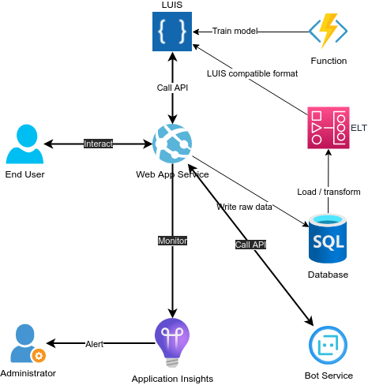

<!-- _class:  lead -->

# Fashion-Insta

## Personal Style Articles Recommender

---

### Executive Summary

- **User problems**

> "_Searching_ for articles is **tedious** and _filtering_ excludes articles I **would have bought**."

> "I end-up _returning_ many articles because they **don't match my style**."

- **Solution** : _recommendations_ based on _Profile informations_ and _Personal Style photos_

| **BUILD**                             | **RUN**                          |
| ------------------------------------- | -------------------------------- |
| Budget : _100K€_                      | Costs : _6K€ / month_            |
| Duration : _4 months_                 | Returns : _15K€ / month_         |
| Main risk : _ML models accuracy_      | Time to profitability : _1 year_ |
| Considerations : _Ethics (AI biases)_ | Obligations : _Legal (RGPD)_     |

---

### Business goals

| Context                                             | Target                  |
| --------------------------------------------------- | ----------------------- |
| _visited articles_ before purchase : **26**         | **21** (_-20%_)         |
| _session duration_ before purchase : **19 minutes** | **15 minutes** (_-20%_) |
| _conversion rate_ : **2.6%**                        | **3%** (_+15%_)         |
| _return rate_ because "I don't like it." : **37%**  | **31.5%** (_-15%_)      |
|                                                     |                         |
| _average sale Value_ : **19.5€**                    | **22.5€** (_+15%_)      |
| _average sale Margin_ : **20%**                     | **22%** (_+10%_)        |

> Source : [Website and CRM statistics](https://www.blogdumoderateur.com/chiffres-cles-e-commerce-2022-taux-conversion-panier-moyen-pages-vues-session/)

---

### Expected returns

---

### Human resources

---

### Technical resources

---

### Financial resources

---

### Agile development

---

---

# Stop

---

### Curent MVP System Architecture

---

### Resources inventory

| **LUIS**                                                                                                                                                                                                                                    | **Chatbot**                                                                                                                                                                                                                            | **Monitoring**                                                                                                                                                                                                                                                                                                                            |
| ------------------------------------------------------------------------------------------------------------------------------------------------------------------------------------------------------------------------------------------- | -------------------------------------------------------------------------------------------------------------------------------------------------------------------------------------------------------------------------------------- | ----------------------------------------------------------------------------------------------------------------------------------------------------------------------------------------------------------------------------------------------------------------------------------------------------------------------------------------- |
| [Language understanding model](https://www.luis.ai/applications)                                                                                                                                                                            | [Bot service](https://portal.azure.com/#@clementfleurypm.onmicrosoft.com/resource/subscriptions/da2e4791-6dd1-422b-848a-a961cef6ab89/resourceGroups/OC_P10_Bot/providers/Microsoft.BotService/botServices/fly_me/overview)             | [Application Insights](https://portal.azure.com/#@clementfleurypm.onmicrosoft.com/resource/subscriptions/da2e4791-6dd1-422b-848a-a961cef6ab89/resourceGroups/OC_P10_Bot/providers/microsoft.insights/components/ocp10-appinsights/overview)                                                                                               |
| [Authoring resource](https://portal.azure.com/#@clementfleurypm.onmicrosoft.com/resource/subscriptions/da2e4791-6dd1-422b-848a-a961cef6ab89/resourceGroups/OC_P10/providers/Microsoft.CognitiveServices/accounts/ocp10-luis-auth/overview)  | [App Service Plan](https://portal.azure.com/#@clementfleurypm.onmicrosoft.com/resource/subscriptions/da2e4791-6dd1-422b-848a-a961cef6ab89/resourceGroups/OC_P10_Bot/providers/Microsoft.Web/serverFarms/ocp10-bot-plan/webHostingPlan) | [Alert Rule](https://portal.azure.com/#view/Microsoft_Azure_Monitoring/UpdateLogSearchV2AlertRuleViewModel/alertId/%2Fsubscriptions%2Fda2e4791-6dd1-422b-848a-a961cef6ab89%2FresourceGroups%2FOC_P10_Bot%2Fproviders%2Fmicrosoft.insights%2Fscheduledqueryrules%2FWARNING%20-%20More%20than%205%20Booking%20Refused%20last%205%20minutes) |
| [Prediction resource](https://portal.azure.com/#@clementfleurypm.onmicrosoft.com/resource/subscriptions/da2e4791-6dd1-422b-848a-a961cef6ab89/resourceGroups/OC_P10/providers/Microsoft.CognitiveServices/accounts/ocp10-luis-pred/overview) | [App Service](https://portal.azure.com/#@clementfleurypm.onmicrosoft.com/resource/subscriptions/da2e4791-6dd1-422b-848a-a961cef6ab89/resourceGroups/OC_P10_Bot/providers/Microsoft.Web/sites/ocp10-bot-webapp/appServices)             | [Monitoring Dashboard](https://portal.azure.com/#@clementfleurypm.onmicrosoft.com/dashboard/private/41e0e40e-2469-4ecf-91c6-d576b3787015)                                                                                                                                                                                                 |

---

### Demo

|                     **Demo**                     |                  **Monitoring**                  |
| :----------------------------------------------: | :----------------------------------------------: |
|  |  |

---

### Target performance management policy

In order to achieve the target performance, the following policy must be implemented :

- **store** each dialogs and inferred _intents_ and _entities_ in a _database_
- **transform and load** (ETL) the raw data in a _datawarehouse_ in a _format compatible with the LUIS service_
- daily **re-train** the _language understanding model_ with the new _intents_ and _entities_ of the **successful** bookings

---

### Target production architecture

---

### Next steps

- **integrate** the bot with multiple _Channels_ (Website, Discord, Teams, Slack, ...)
- **improve** the bot capacity to handle more _Intentions_ and _Entities_
- **connect** the bot to an actual _Flight booking_ system
- **monitor** more precisely the bot's performance : _errors_, _performance_, _availability_, ...
- **implement** the model continuous _training_ and _deployment_

---

<!-- _class:  lead -->

# Fly Me

## Flights booking chatbot

