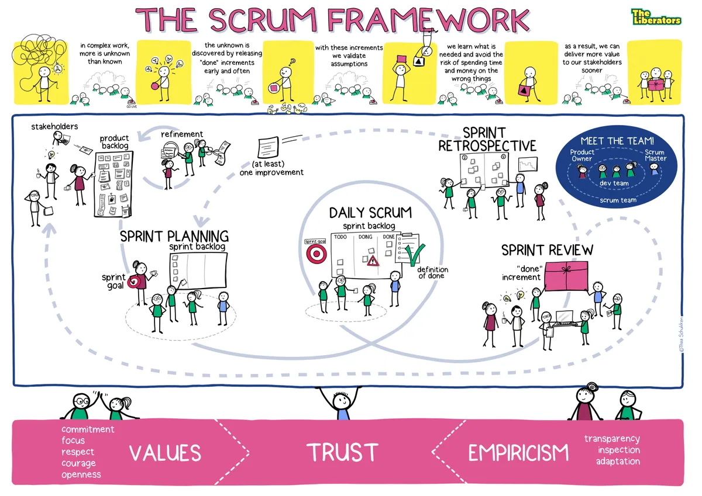
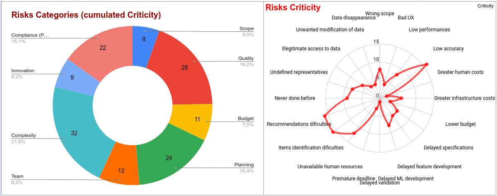
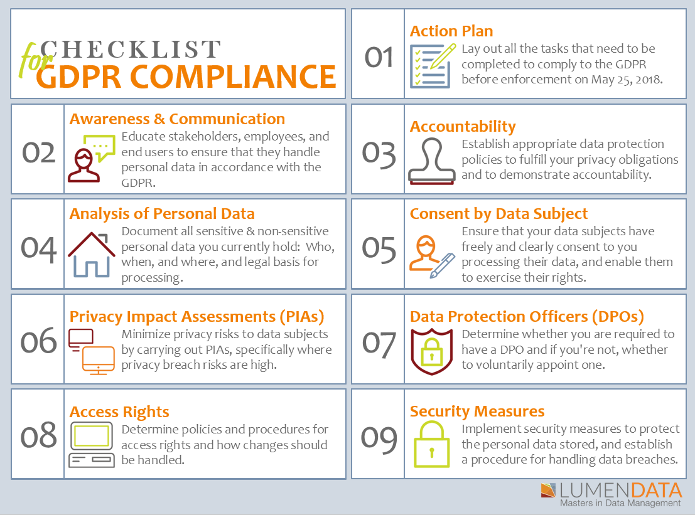
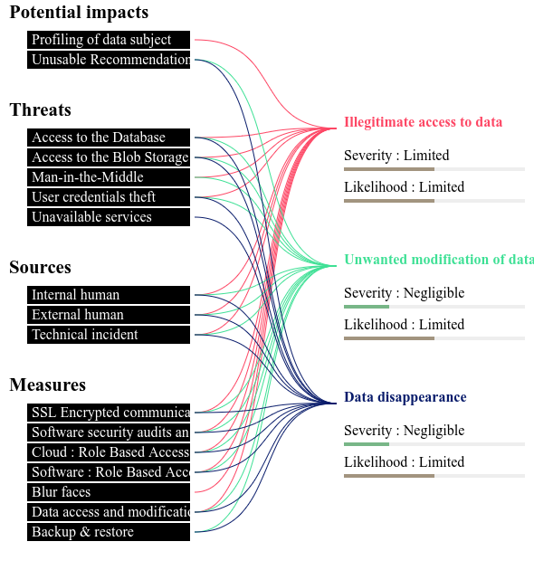
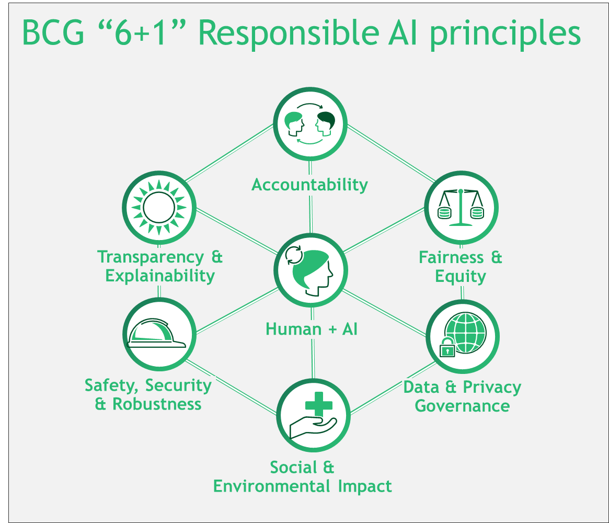

<!-- _class:  lead -->

# Fashion-Insta

## Personal Style Articles Recommender

---

### Executive Summary

- **User problems**

> "_Searching_ for articles is **tedious** and _filtering_ excludes articles I **would have bought**."

> "I end-up _returning_ many articles because they **don't match my style**."

- **Solution** : _recommendations_ based on _Profile informations_ and _Personal Style photos_

| **BUILD**                             | **RUN**                          |
| ------------------------------------- | -------------------------------- |
| Budget : _100K€_                      | Costs : _6K€ / month_            |
| Duration : _4 months_                 | Returns : _15K€ / month_         |
| Main risk : _ML models accuracy_      | Time to profitability : _1 year_ |
| Considerations : _Ethics (AI biases)_ | Obligations : _Legal (RGPD)_     |

---

### Business goals

| Context                                             | Target                  |
| --------------------------------------------------- | ----------------------- |
| _visited articles_ before purchase : **26**         | **21** (_-20%_)         |
| _session duration_ before purchase : **19 minutes** | **15 minutes** (_-20%_) |
| _conversion rate_ : **2.6%**                        | **3%** (_+15%_)         |
| _return rate_ because "I don't like it." : **37%**  | **31.5%** (_-15%_)      |
|                                                     |                         |
| _average sale Value_ : **19.5€**                    | **22.5€** (_+15%_)      |
| _average sale Margin_ : **20%**                     | **22%** (_+10%_)        |

> Source : [Website and CRM statistics](https://www.blogdumoderateur.com/chiffres-cles-e-commerce-2022-taux-conversion-panier-moyen-pages-vues-session/)

---

### Expected returns

|                              | Scenario 1 (Target)        | Scenario 2       |
| ---------------------------- | -------------------------- | ---------------- |
| Value increase (base = 20€)  | **22.5€** (_+15%_)         | **25€** (_+25%_) |
| Margin increase (base = 20%) | **22%** (_+10%_)           | **23%** (_+15%_) |
| **Returns**                  | -------------------------- | ---------------- |
| Monthly Profit after 1 year  | **18K€**                   | **30K€**         |
| ROI after 1 year             | **2%**                     | **70%**          |
| Time to profitability        | **1 year**                 | **7 months**     |

---

### RUN Treasury

---

### Human resources

| **Role** (ADR)                     | **BUILD** (4 months) | **RUN** (1 year)    |
| ---------------------------------- | -------------------- | ------------------- |
| _Product Manager_ (450€/d)         | _5 K€_ (11 d)        | _2.7 K€_ (6 d)      |
| _Product Owner_ (350€/d)           | _9.8 K€_ (28 d)      | _2.1 K€_ (6 d)      |
| _SCRUM Master_ (300€/d)            | _10.2 K€_ (34 d)     | _3.6 K€_ (12 d)     |
| _Frontend developer_ (300€/d)      | _18.3 K€_ (61 d)     | _3.6 K€_ (12 d)     |
| _Backend developer_ (350€/d)       | _21.4 K€_ (61 d)     | _4.2 K€_ (12 d)     |
| _AI / ML / Data Engineer_ (400€/d) | _22.8 K€_ (57 d)     | _19.2 K€_ (48 d)    |
| _QA Engineer_ (300€/d)             | _5.7 K€_ (19 d)      | _3.6 K€_ (12 d)     |
| _SRE_ (400€/d)                     | _4.4 K€_ (11 d)      | _9.6 K€_ (24 d)     |
| **TOTAL**                          | **97.5 K€** (282 d)  | **48.6 K€** (132 d) |

---

### Technical resources

| **Articles detection** + **Recommender** | **BUILD** (4 months) | **RUN** (1 year) |
| ---------------------------------------- | -------------------- | ---------------- |
| _Blob Storage_                           | 2 €                  | 780 €            |
| _Function_                               | 0 €                  | 0 €              |
| _Machine Learning (GPU)_                 | 1.4 K€               | 8 K€             |
| _Machine Learning_                       | 310 €                | 10.3 K€          |
| _NoSQL Database_                         | 2 €                  | 780 €            |
| **TOTAL**                                | **1.7 K€**           | **20 K€**        |

---

### BUILD Treasury

---

### Being Agile (Manifesto)

---

### Doing Agile (SCRUM)

---

### Product Backlog : MVP

| ID  | Pred. | Milestone | Title                    | Value           | Cost   | Priority |
| :-: | :---: | :-------: | ------------------------ | --------------- | ------ | :------: |
|  1  |       |    MVP    | Update privacy notice    | 8 - Must have   | 1 - S  |    8     |
|  2  |       |    MVP    | Update privacy settings  | 8 - Must have   | 2 - M  |    4     |
|  3  |       |    MVP    | Update profile settings  | 2 - Could have  | 4 - L  |   0.5    |
|  4  |       |    MVP    | Submit a photo           | 8 - Must have   | 8 - XL |    1     |
|  5  |   4   |    MVP    | Delete a photo           | 4 - Should have | 4 - L  |    1     |
|  6  |  3;4  |    MVP    | Personal recommendations | 8 - Must have   | 8 - XL |    1     |

---

### Product Backlog : V1

| ID  | Pred. | Milestone | Title                          | Value           | Cost  | Priority |
| :-: | :---: | :-------: | ------------------------------ | --------------- | ----- | :------: |
|  7  |   4   |    V1     | Create a style                 | 4 - Should have | 4 - L |    1     |
|  8  |   7   |    V1     | List my styles                 | 4 - Should have | 2 - M |    2     |
|  9  |   7   |    V1     | Edit a style                   | 1 - Won't have  | 1 - S |    1     |
| 10  |   7   |    V1     | Delete a style                 | 2 - Could have  | 2 - M |    1     |
| 11  |   7   |    V1     | Manage a style's photos        | 4 - Should have | 2 - M |    2     |
| 12  |  7;6  |    V1     | Personal style recommendations | 4 - Should have | 2 - M |    2     |

---

### Project Risks

---

### Risks prevention : Action Plan

|  Status  | Owner             | Action                                       |
| :------: | ----------------- | -------------------------------------------- |
| **TODO** | _AI Engineer_     | proof of concept during first Sprint         |
| **TODO** | _AI Engineer_     | recommendation system evaluation metric      |
| **TODO** | _Product Manager_ | book required resources in advance           |
| **TODO** | _Product Owner_   | user research during first Sprint            |
| **TODO** | _Tech Lead_       | performance testing                          |
| **TODO** | _Product Manager_ | identify DPO and organisation representative |

---

### Legal Obligation : GDPR

---

### Privacy Impact Assessment (PIA)

---

### Ethical Consideration : Responsible AI

---

### Executive Summary

- **User problems**

> "_Searching_ for articles is **tedious** and _filtering_ excludes articles I **would have bought**."

> "I end-up _returning_ many articles because they **don't match my style**."

- **Solution** : _recommendations_ based on _Profile informations_ and _Personal Style photos_

| **BUILD**                             | **RUN**                          |
| ------------------------------------- | -------------------------------- |
| Budget : _100K€_                      | Costs : _6K€ / month_            |
| Duration : _4 months_                 | Returns : _15K€ / month_         |
| Main risk : _ML models accuracy_      | Time to profitability : _1 year_ |
| Considerations : _Ethics (AI biases)_ | Obligations : _Legal (RGPD)_     |

---

<!-- _class:  lead -->

# Fashion-Insta

## Personal Style Articles Recommender
